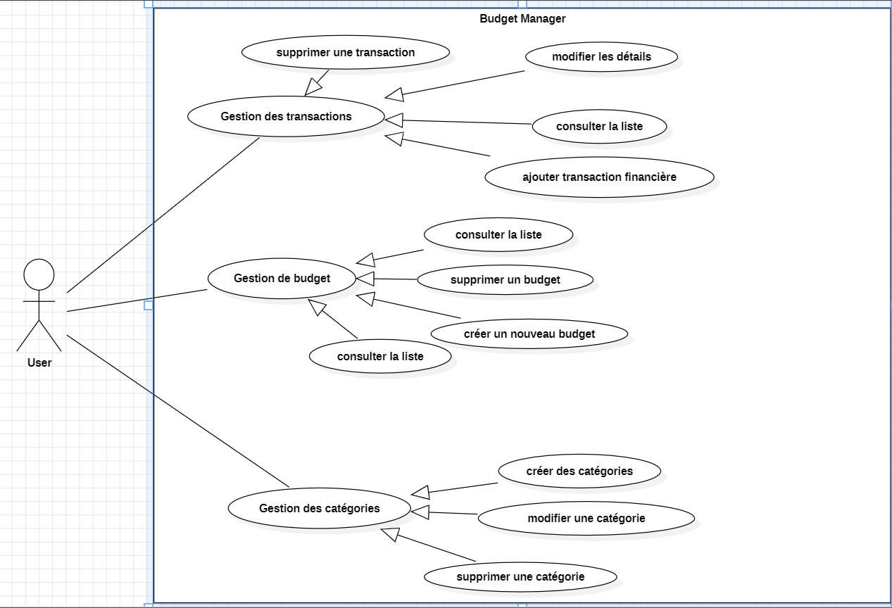
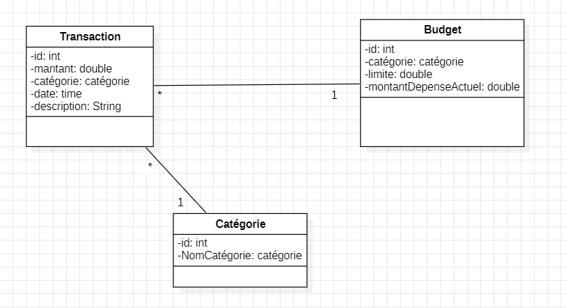
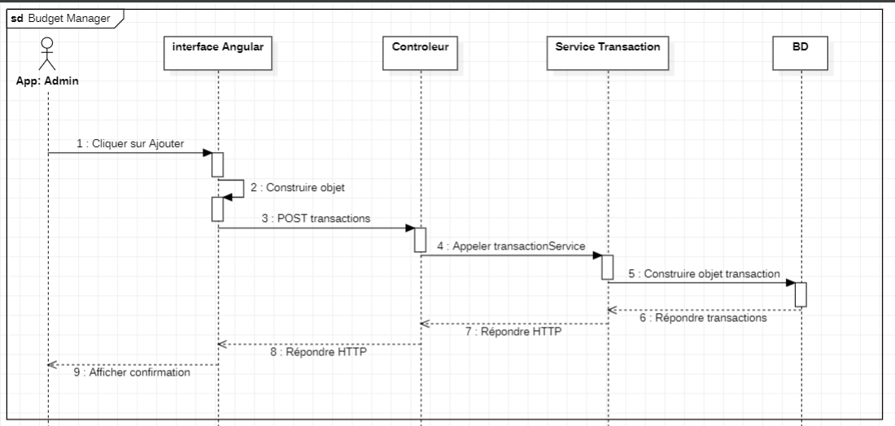

# 💰 Budget Manager

 Application de gestion budgétaire personnelle pour enregistrer, suivre et optimiser vos finances.


## 🚀 Présentation

**Budget Manager** est une application web complète permettant à un utilisateur de :

- Gérer ses **transactionModels** (dépenses & revenus)
- Créer des **budgets** par catégorie (logement, transport, etc.)
- Définir ses **propres catégories**
- Suivre ses dépenses pour mieux contrôler ses finances


## 🛠️ Technologies

### Backend (Java / Spring Boot)

- Spring Boot
- Spring Data JPA
- Lombok
- MapStruct
- JUnit

### Frontend (Angular 16+)

- Angular CLI
- Angular Router
- Angular Forms (Template & Reactive)
- RxJS
- Bootstrap / CSS
- HttpClient


## 🧑‍💻 Fonctionnalités principales

### 🔄 Gestion des transactionModels

- ➕ Ajouter une transaction (montant, date, description, catégorie)
- 📋 Voir toutes les transactionModels
- ✏️ Modifier une transaction
- ❌ Supprimer une transaction
- 🔍 Filtrer / Trier par date, montant ou catégorie

### 📊 Gestion de budget

- ➕ Créer un budget par catégorie
- 📈 Suivre les dépenses par rapport au budget
- ✏️ Modifier un budget
- ❌ Supprimer un budget

### 🗂️ Gestion des catégories

- ➕ Créer une catégorie personnalisée
- ✏️ Modifier une catégorie
- ❌ Supprimer une catégorie


## 📸 Aperçu de l'interface (UI)


- 🎨 **UX optimisée** : Formulaires simples et validation en temps réel
- 📱 **Mobile friendly** : Interface adaptative
- 📈 **Visualisation claire** : Budgets & transactionModels bien organisés


## ⚙️ Lancement du projet

### Backend (Spring Boot)

```bash
# Cloner le dépôt
git clone https://github.com/MrRidadev/Budget-Manager-.git
cd budget-manager/backend

# Lancer l'application
./mvnw spring-boot:run
```

## 🧩 Conception UML
### 1. 📌 Diagramme de cas d'utilisation (Use Case)
Ce diagramme montre les interactions entre l’utilisateur et les principales fonctionnalités du système.




### 2. 🧱 Diagramme de classes




### 3. 🔁 Diagramme de séquence (exemple : ajouter une transaction)

